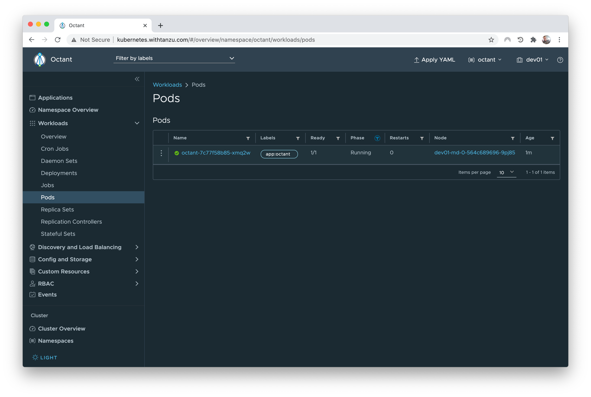

# Running Octant in Kubernetes

Use this repository to deploy [Octant](https://octant.dev/),
the open source Kubernetes dashboard, to your favorite cluster.



No need to run Octant on your workstation anymore!

**Please note this repository is not production ready**:
anyone having access to Octant basically has access to your cluster.
You've been warned!

## How to use it?

This deployment relies on [Contour](https://projectcontour.io/) as an ingress controller, in order to support WebSocket which is used by Octant.

Before you deploy Octant to your cluster, you need to tune some configuration files.

Edit file [k8s/deployment.yml](k8s/deployment.yml) and set the Fully Qualified Domain Name which will
be used to access Octant:

```yaml
args:
  - --ui-url
  # Set the Fully Qualified Domain Name to use when exposing Octant.
  # This value must match the fqdn parameter in ingress.yml.
  - kubernetes.withtanzu.com
```

Edit file [k8s/ingress.yml](k8s/ingress.yml) with the same value:

```yaml
virtualhost:
  # Set the Fully Qualified Domain Name to use when exposing Octant.
  # This value must match the ui-url parameter in deployment.yml.
  fqdn: kubernetes.withtanzu.com
```

Make sure your DNS configuration matches the FQDN, using the public IP address
of the Contour ingress controller.

One last thing: create a `kubeconfig` file in `k8s`, with the content of your `.kube/config` file.
This file will be used by Octant to access your clusters.

You're ready to go!

Deploy Octant to your cluster with this command:

```bash
$ kubectl apply -k k8s
```

Now go to your FQDN using your browser, and enjoy Octant!

## Contribute

Contributions are always welcome!

Feel free to open issues & send PR.

## License

Copyright &copy; 2021 [VMware, Inc. or its affiliates](https://vmware.com).

This project is licensed under the [Apache Software License version 2.0](https://www.apache.org/licenses/LICENSE-2.0).
